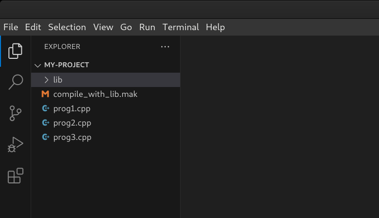
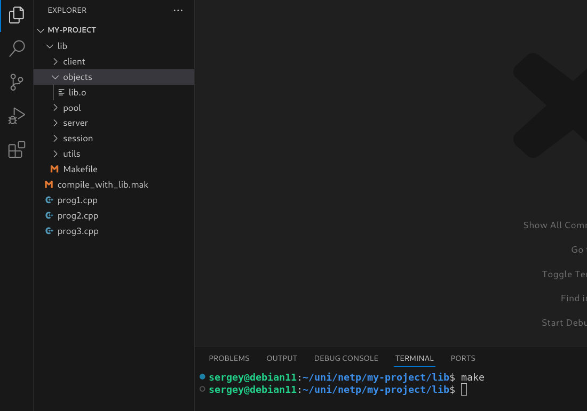
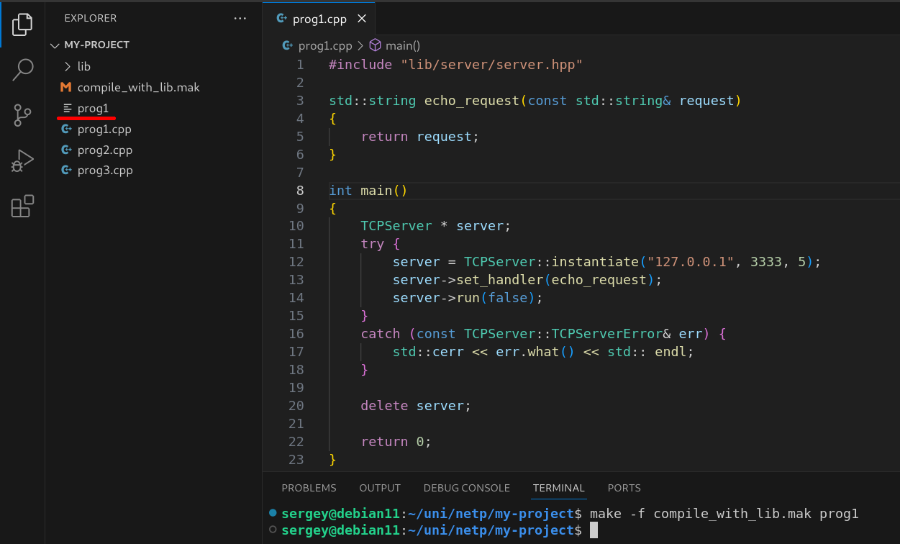

# Network programming final project.
## A simple library for creating and running TCP servers.

### Description.
> This is a C++ library that provides simple classes to create and maintain
the TCP connection between client and server,  
so the user can abstract out and specify only the way the server should handle the requests.  
>
> The library consists of the following modules:
> - `client` - provides features for creating and maintaining 
>              interactive shell for sending/receiving the request/responses to/from the server.
> - `server` - provides features for creating and starting up a TCP server.
> - `session`- provides features for establishing a TCP connection. Used by `client` module.
> - `pool`   - provides features for creating and managing a thread pool. Used by `server` module.
> - `utils`  - provides some additional useful utilities. Used by `client` and `server` modules.
>
> The documentation can be found in `doc.md` file.

### Notes.
> The library was created on Debian 11 and
it haven't been tested on other Linux-based operating systems,  
so there is no guarantee that it can be successfully built on another OS
without modifing Makefiles or using other build configurations.

### Prerequisites.
> To build this library is necessary to have:
> 1. Linux-base operating system.
> 2. `ld`  - The GNU linker.
> 3. `g++` - C++ compiler.

### How to build and use.
> First of all, `lib` directory is supposed to be put into the directory of the entire project that
uses its modules and declarations.  
Also, if the compilation of project is simple, it can be helpful to put into the project directory
`compile_with_lib.mak` makefile.  
  

> The next step is actually to generate object file for the whole library, 
so it can be linked to object files of the project:  
> 1. Go to the lib directory. There is `Makefile`.
> 2. Execute the command `make`.
> 3. `objects` directory is created and the library object file `lib.o` is in it.
> 4. Now, `lib.o` file can be linked to other object files, so they can use library definitions. 

> There is an example how to generate an executable file from `prog1.cpp`.  
> To compile `.cpp` file that uses the library declarations it is needed to execute the following command:  
> `make -f compile_with_lib.mak <cpp_filename>` - it will produce `<cpp_filename>` executable file.
> In our case, we should write `make prog1`.  
**Important note**: executable filename and `.cpp` filename need to match completelly except `.cpp` suffix.

