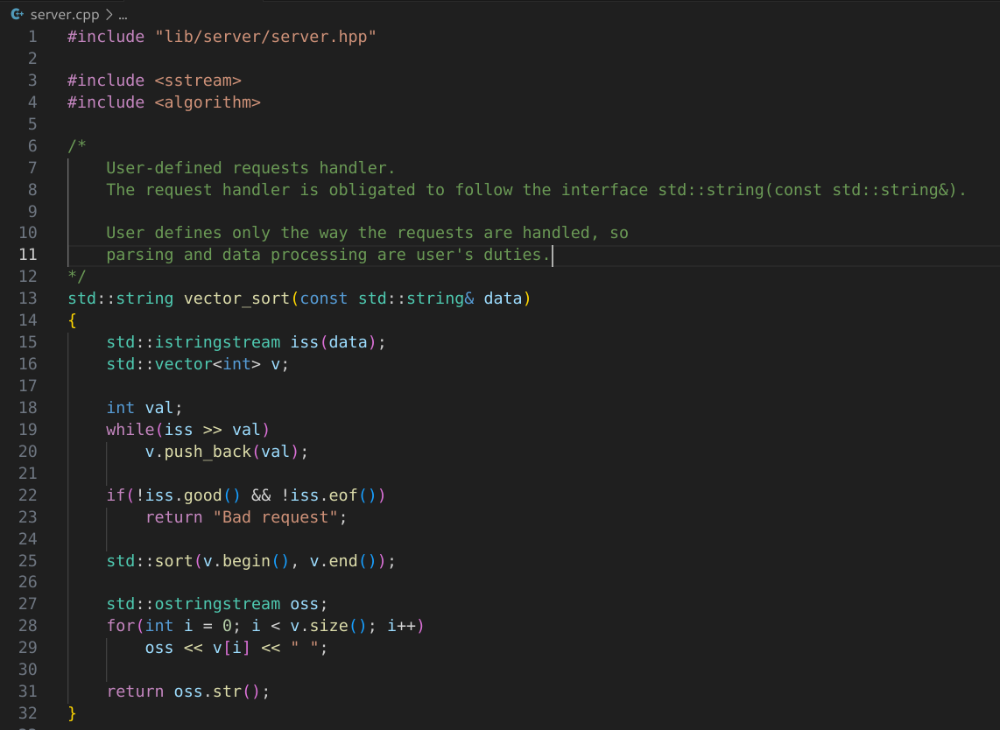
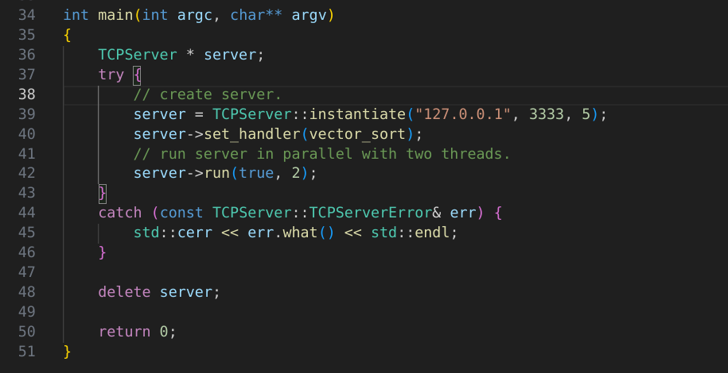
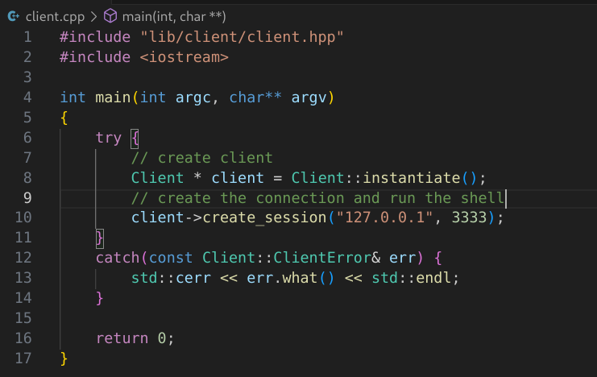
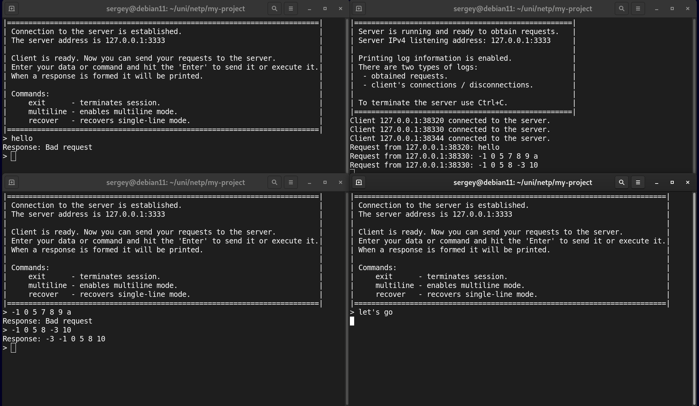

# Documentation

## `server` module
### `TCPServer` class

> `TCPServer` class simplifies the creation and starting up of a TCP server.  
This class follows the Singleton design pattern which means that only one instanstance of this class can be created.  
The instance of this class behaves as a server that accepts the connections from the clients,  
receiving requests and sending responses. The user has a control only over the way the request are handled.
>
> `TCPServer` methods:  
> - `static TCPServer* instantiate(const std::string& ip_addr="127.0.0.1", short port=INADDR_ANY, int backlog=1)`  
> Creates `TCPServer` instance.  
> **Parameters**:  
> &emsp;`ip_addr` - specifies the IPv4 address of a host. The default values is loopback address.  
> &emsp;`port`    - specifies the port which is used to listen for the connection requests. 
The default value is an arbitrary free port.   
> &emsp;`backlog` - specifies the max number of connections waiting to be accepted.  
> **Returns**:  
> &emsp;Returns the pointer to created instance.
>  
> - `void set_handler(std::function<std::string(const std::string&)> handler)`
> Specifies function `handler` which will be in charge of processing the requests.  
> The function that is going to be handler needs to necessarily be of the type `std::string(const std::string&)`.  
> **Parameters**:  
> &emsp;`handler` - specifies procedure that handles the requests.  
> **Returns**:  
> &emsp;Nothing.
>  
> - `void run(bool parallel, int num_of_threads = 1)`  
> Starts up the server. The server can running in sequential or parallel mode.  
> The handler needs to be set befor callig this method. Otherwise an exception is thrown.  
> **Parameters**:  
> &emsp;`parallel` - specifies the server working mode: parallel or sequential.  
&emsp;&emsp;If `parallel` is `true` then each session between the server and 
the client will be managed by a separate thread.  
&emsp;&emsp;So multiple sessions can be maintained simultaneously, but there is a limitation: 
the max number of sessions is `num_of_threads`.  
&emsp;&emsp;If the number of connections will be bigger than `num_of_threads` then some clients will just waiting till
another session is terminated.  
&emsp;&emsp;If `parallel` is `false` then connections and requests will be proccessed asynchronously on only one thread.  
> &emsp;`num_of_threads` - specifies the max number of threads that can run on the server.  
> **Returns**:  
> &emsp; Nothing.  
> **Throws**:  
> &emsp; Throws `TCPServer::TCPServerError` if handler isn't set.  
>  
> Deleted methos:
>  
> - `TCPServer& operator=(const TCPServer&) = delete`
> - `TCPServer(TCPServer&) = delete`
> - `TCPServer(const TCPServer&) = delete`
> - `TCPServer(TCPServer&&) = delete`
>  
> `TCPServer` inner classes and structures:  
> - `TCPServerError` class  
> &emsp; Simple `std::exception` wrapper.  
> &emsp;&emsp; Methods:  
> &emsp;&emsp; `TCPServerError(const std::string& _msg)`, where `_msg` is an error message.  
>  
> - `Info` structure  
> &emsp; Stores the information about the server: IPv4 address, port, the entire address (IP:port).  
> &emsp; Fields:  
> &emsp;&emsp; `std::string ip_address` - IPv4 address.  
> &emsp;&emsp; `short port`             - listening port.  
> &emsp;&emsp; `std::string endpoint`   - the entire address (IP:port).
>  
> `TCPServer` data members:    
> &emsp; `info` - stores the information on the server. 
`info` fields are filled during `TCPServer` instantiation. Type: `Info`.

## `client` module
### `Client` class

> `Client` class initiates a connection to a server and provides pretty CLI for sending/receving requests/responses.  
> This class follows the Singleton design pattern, so only one instance can be created.  
> The `Client` instance initiates a connection to a server and if it's successfull then runs the shell 
till it's terminated. Terminating the shell means to terminate session and vice versa.
>  
> `Client` methods:  
> - `static Client* instantiate()`  
> Creates `Client` class instance.  
> **Returns**:  
> &emsp; A raw pointer to the created instance.
>  
> - `void create_session(const std::string& service_addr, short service_port)`  
> Tries to establish connection to the server. If it's successfull then runs the shell.  
> For establishing connections uses `session` module under the hood.  
> **Parameters**:  
> &emsp;&emsp; `service_addr`  - the server's IPv4 address.  
> &emsp; &emsp; `service_port` - the server's port.  
> **Returns**:  
> &emsp; Nothing.  
> **Throws**:  
> &emsp; Throws `Client::ClientError` 
if the client isn't able to receive/send requests/responses or the server closed the connection.
>  
> Deleted methos:
>  
> - `Client& operator=(const Client&) = delete`
> - `Client(Client&) = delete`
> - `Client(const Client&) = delete`
> - `Client(Client&&) = delete`
>  
> `Client` inner classes and structures:  
> - `ClientError` class  
> &emsp; Simple `std::exception` wrapper.  
> &emsp;&emsp; Methods:  
> &emsp;&emsp; `Client(const std::string& _msg)`, where `_msg` is an error message.  

## `session` module
### `Session` class

> `Session` class enables a session (connection + data transferring) with specified host.  
> This class abstracts out sockets and system primities for working with sockets.  
>  
> `Session` methods:  
> - `Session(const std::string& service_addr, short service_port)`  
> Instantiates `Session` as initializes and configures the socket 
which will be used to create a connection to the host with specified address.  
Saves the given arguments for the deferred connection.  
> **Parameters**:  
> &emsp; `service_addr` - the host's IPv4 address.  
> &emsp; `service_port` - the host's port.  
> **Throws**:  
> &emsp; Throws `Session::SessionError` if something went wrong during socket configuration.  
>  
> - `void connect_to_service()`  
> Tries to connect to the service (application on the host). Service address is set in the `Session` constructor.  
> This call may be pending if the service can't immediately respond to the connection request.  
> Throws if a connection can't be established.  
> **Throws**:  
> &emsp; Throws `Session::SessionError` if the try to connect to the service failed.  
> - `void send_data(const std::string& data)`  
> Sends the given data to the service. Throws if something goes wrong.  
> The data isn't supposed to have anything but payload (the actual info we want to send).  
> **Parameters**:  
> &emsp; `data` - payload to be sent to the service.  
> **Returns**:  
> &emsp; Nothing.  
> **Throws**:  
> &emsp; Throws `Session::SessionError` if data sending failed. Example: not the entire amount of data is sent. 
>   
> - `std::string receive_data()`  
> Receives data from the service and when all the data is received returns it.  
> Throws if something goes wrong or the connection is closed.  
> **Returns**:  
> &emsp; Returns the received data as a `std::string`.  
> **Throws**:  
> &emsp; Throws `Session::SessionError` 
if some unknown error occured or the connection was closed on the service side.  
>  
> Deleted methos:
>  
> - `Session& operator=(const Session&) = delete`
> - `Session(Session&) = delete`
> - `Session(const Session&) = delete`
> - `Session(Session&&) = delete`
>  
> `Session` inner classes and structures:  
> - `SessionError` class  
> &emsp; Simple `std::exception` wrapper.  
> &emsp;&emsp; Methods:  
> &emsp;&emsp; `SessionError(const std::string& _msg)`, where `_msg` is an error message.  
>  
> - `ServiceInfo` structure  
> &emsp; Stores the information about the service: IPv4 address, port, the entire address (IP:port).  
> &emsp; Fields:  
> &emsp;&emsp; `std::string ip_address` - IPv4 address.  
> &emsp;&emsp; `short port`             - listening port.  
> &emsp;&emsp; `std::string endpoint`   - the entire address (IP:port).
>  
> `Session` data members:    
> &emsp; `service_info` - stores the information on the service. 
`service_info` fields are filled during `Session` instantiation. Type: `ServiceInfo`.  

## `pool` module
### `ThreadPool` class

> `ThreadPool` class provides methods for processing multiple tasks simultaneously.  
>  
> `ThreadPool` methods:  
> - `ThreadPool() = default`  
> Just instantiates `ThreadPool` without doing anything else.  
>  
> - `void start(int number_of_threads)`  
> Creates `number_of_threads` threads which waits until there are available tasks in a task queue.  
> There are only one task per thread and all the operations related to modifying the task queue are thread-safe.  
> All the threads can be stopped when `stop()` method is called and there are no tasks in the task queue.  
> *Note*: if `stop()` method is called but there are available tasks in the queue then the threads will be stopped
after finishing all the tasks.  
> **Parameters**:  
> &emsp; `number_of_threads` - specifies the number of threads to run.  
> **Returns**:  
> &emsp; Nothing.  
>  
> - `void stop()`  
> Signals threads to stop. It isn't force to stop the threads that are processing tasks at the moment signal is sent.  
> Waits till working threads finish the tasks and the task queue is empty.  
>  
> - `int busy_threads()`  
> Returns the number of threads that process tasks at the moment this method is called.  
>  
> - `template<typename T> auto execute_task(T task)`  
> Adds `task` to the task queue and signals one threads, if available, to start processing `task`.  
> **Parameters**:  
> &emsp; `task` - callable object that returns value of arbitrary type and doesn't take arguments.  
> **Returns**:  
> &emsp; Returns `std::future<T>` value which stores the result of `task` execution.  

## `utils` module

> `std::vector<std::string> chunks(const std::string& str, int chunk_size)`  
> Splits `str` into chunks with size of `chunk_size`. The last chunk size is less or equal to `chunk_size`.  
> **Returns**:  
> &emsp; `std::vector` that contains chunks.  

## Simple example: remote sorter
### Source code

> This example demonstrates how to create the client and the server and how to make them to communicate.  
> The client will send the requests in form of a number sequence and receive the response from the server.  
> The server will receive the request (numbers) and sort the numbers, 
after that the sorted sequence will be sent to the client.  

> `server.cpp`  

> `client.cpp`

### Demonstration work

> In the following demonstration we can see one server and three clients.  
> Each client sends different requests. But there are an interesting moment:  
> Third client (right bottom corner) doesn't get any response. It is so because server is running only two threads,  
so there is no available thread that would process it's requests.

